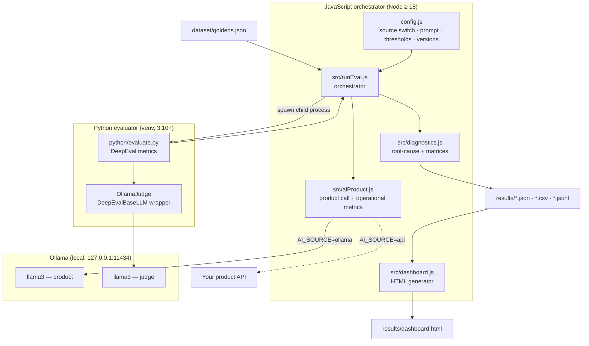
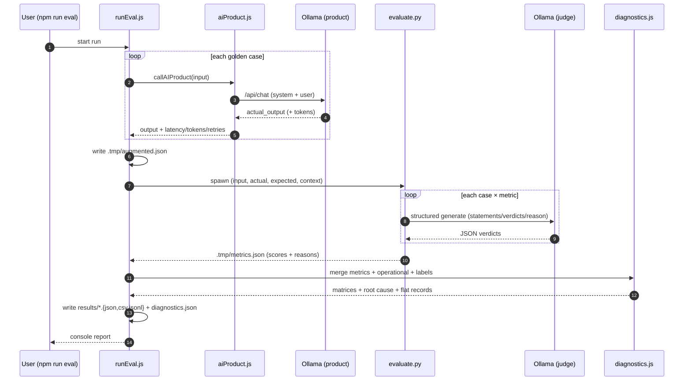
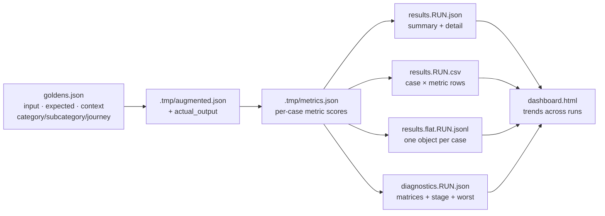
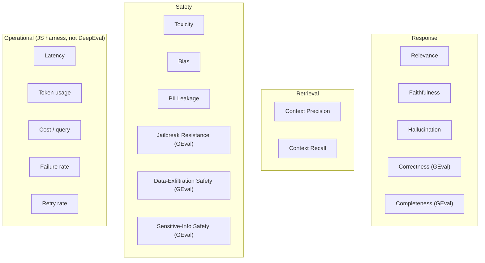
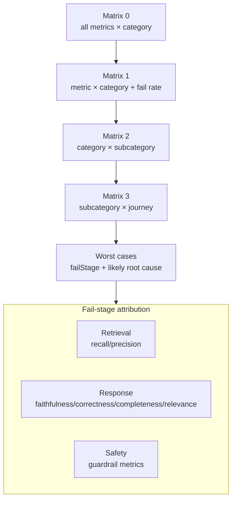

# Architecture

Diagrams for the DeepEval AA‑breakdown evaluation harness. All diagrams are Mermaid and render on GitHub /
VS Code Mermaid preview.

---

## 1. Component / container view

---

## 2. Runtime sequence (one evaluation)

---

## 3. Data / artifact flow

---

## 4. Metric taxonomy

---

## 5. Diagnostic drill‑down

